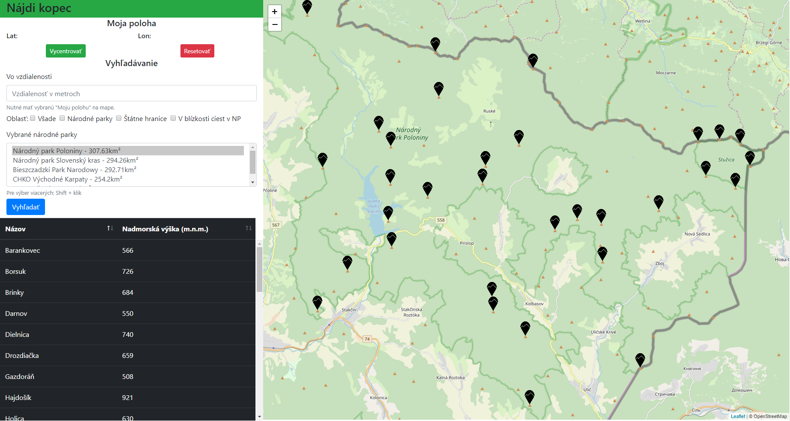
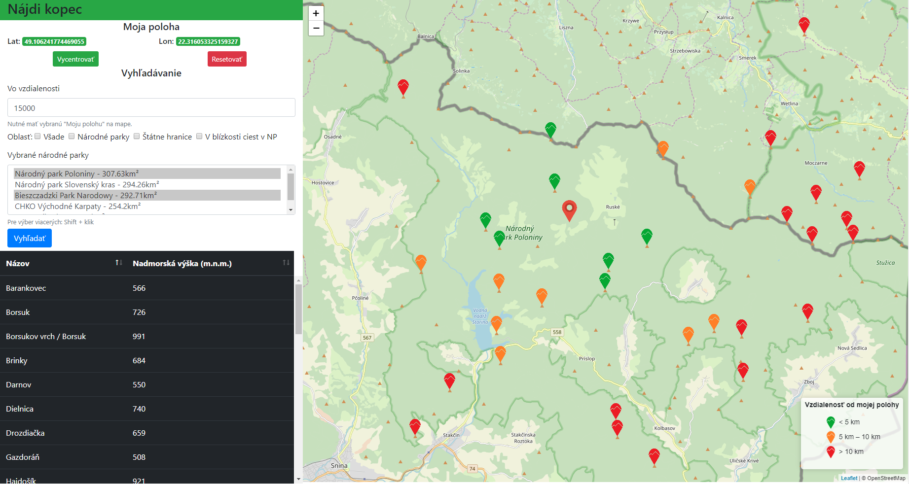

# Prehľad

Vytvorená aplikácia na mape znázorňuje kopce z prevažnej časti východného Slovenska, malej časti Ukrajiny a Poľska.

Kľúčové vlastnosti:
- vyhľadávanie kopcov v rôznych kontextoch
    - v celej dostupnej oblasti
    - v národných parkoch
    - v konkrétnych národných parkoch
    - v národných parkoch dostupných autom/bicyklom
    - kopce nachádzajúce sa na resp. v blízkosti (do 200m) štatných hraníc
- možnosť výberu aktuálnej polohy a definovanie perimetra prehľadávania v metroch
    - farebné odlíšenie kopcov vzhľadom na vybranú vzdialenosť používateľa + legenda
    - kombinácia s predchádzajúcimi možnosťami filtra oblastí
- prehľadné zobrazenie nájdených kopcov v interaktívnej tabuľke
    - po kliknutí na riadok tabuľky je pohľad automaticky presunutý na vybraný kopec, ktorý je aj farebne odlíšený
- tooltip s názvom kopca a jeho nadmorskou výškou
- informácia o rozlohe národných parkov v km²

Aplikácia je logicky rozdelená na 2 časti. Klientská časť predstavuje webovú aplikáciu pričom hlavnou časťou FE je [Leaflet](https://leafletjs.com/) mapový komponent.
Backend je vytvorený pomocou minimalistického web-frameworku [Express.js](https://expressjs.com/) určeného pre [Node.js](https://nodejs.org/en/).
GEO dáta sú uložené v [PostGIS](https://postgis.net/) a komunikáciu medzi [BE](#backend) a [FE](#frontend) zabezpečuje [REST API](#api).

*Pohľad na základné filtrovanie podľa oblasti* 



*Vyhľadávanie zohľadňujúce vybranú lokalitu* 



# Frontend

Webová aplikácia je napísaná z prevažnej časti pomocou šablónovacieho nástroja [Pug.js](https://pugjs.org), ktorý následne vygeneruje HTML, ktoré využíva štýl a komponenty z [Bootstrap](https://getbootstrap.com/).
V HTML sa ďalej nachádzajú kúsky JS a jQuery, ktoré sa starajú o validáciu a lepšiu interaktívnosť/použiteľnosť aplikácie.
Na zobrazenie výsledkov vyhľadávania sú použité [DataTables](https://datatables.net/).

O zobrazovanie vyhľadaných GEO dát sa stará [Leaflet](https://leafletjs.com/). Použil som mapovú vrstvu z [OpenStreetMap](https://www.openstreetmap.org), ktorej štýl
bol rozšírený o vlastné značky aktuálnej polohy, značky kopcov spolu s legendou, ktoré sú farebne odlíšené pri vyhľadávaní vzhľadom na vybranú lokalitu.

Všetko spomenuté a relevantné sa nachádza v súbore [map.pug](views/map.pug).

# Backend

Backend je napísaný pomocou jednoduchého web-frameworku [Express](https://expressjs.com/) určeného pre [Node.js](https://nodejs.org/en/). 
BE sa stará o pripojenie k databáze, obsluhu requestov a spracovanie výsledkov. Relevantnou časťou z pohľadu BE je súbor [index.js](routes/index.js).

Na prácu s databázou bola využitá knižnica [Node Postgres](https://node-postgres.com/) a tvorbu named parametrizovaných SQL dopytov [yesql](https://www.npmjs.com/package/yesql).

## Dáta

Dáta použité pre tento projekt pochádzajú z [Open Street Maps](https://www.openstreetmap.org/) a zahŕňajú prevažnú časť východného Slovenska, časť Ukrajiny a Poľska.
Stiahnutý súbor vo formáte `.osm` (veľkosť cca 1.02GB) som do [PostGIS](https://postgis.net/) importoval pomocou nástroja [osm2pgsql](https://wiki.openstreetmap.org/wiki/Osm2pgsql).

Postgre/PostGIS je prevádzkovaný ako [Docker](https://www.docker.com/) kontajner.

### SQL

Po importe dát som si vo všetkých tabuľkých vytvoril nový stĺpec obsahujúci geomtriu v štandarde `WGS84` pomocou transformácie pôvodnej geometrie funkciou `ST_Transform(way, 4326);`

Pre urýchlenie dopytov som vytvoril v používaných tabuľkách indexy na geometrie ako aj indexy pre častou používané atribúty vo filtrovaní (príklad v súbore [pdt_query.sql](pdt_query.sql)). 
Na transformáciu GEO dát do formátu GeoJSON bola použitá štandardná PostGIS funkcia `ST_AsGeoJSON`.

Aby bolo možné používať výsledok SQL dopytu v knižnici Leaflet, ktorá potrebuje dáta v špecifickom tvare na BE som si vytvoril nasledujúcu wrapper funkciu:
```javascript
function peaksForLeaflet(withDist, query) {
    if (withDist) {
        return `
    SELECT row_to_json(fc)
      FROM (SELECT 'FeatureCollection' AS type, array_to_json(array_agg(f)) AS features
        FROM (SELECT 'Feature' AS type, ST_AsGeoJSON(p.geom)::json AS geometry, row_to_json((p.name, p.ele, ST_Distance_Spheroid(ST_Centroid(p.geom), ST_SetSRID(ST_Point(:lon, :lat),4326), 'SPHEROID["WGS 84",6378137,298.257223563]'))) AS properties ${query}
        ) AS f
      ) AS fc
    `;
    } else {
        return `
    SELECT row_to_json(fc)
      FROM (SELECT 'FeatureCollection' AS type, array_to_json(array_agg(f)) AS features
        FROM (SELECT 'Feature' AS type, ST_AsGeoJSON(p.geom)::json AS geometry, row_to_json((p.name, p.ele)) AS properties ${query}
        ) AS f
      ) AS fc
    `;
    }
}
```

Dopyty pre všetky scenáre sa nachádzajú na BE v súbore [index.js](routes/index.js).
Keďže mojím cieľom bolo, aby mal používateľ stále možnosť použiť pri vyhľadávaní svoju polohu vytvoril som nasledujúcu funkciu, kotrá na základe parametrov
zo základnej query vytvorila parematrizovanú query:
```javascript
const distanceCondition = `AND ST_Distance_Spheroid(ST_Centroid(p.geom), ST_SetSRID(ST_Point(:lon, :lat),4326), 'SPHEROID["WGS 84",6378137,298.257223563]') < :dist`;

function buildQuery(withDist, baseQuery, values = {}) {
    return withDist ? named(peaksForLeaflet(withDist, baseQuery(distanceCondition)))(values) : named(peaksForLeaflet(withDist, baseQuery()))(values);
}
```
 Príklad "základného" dopytu:
 ```javascript
const defaultPeaksQuery = (maybeDist = '') => {
    return `FROM planet_osm_point AS p WHERE p.natural = 'peak' AND p.name IS NOT NULL AND p.ele IS NOT NULL ${maybeDist}`;
};
```
Príklad tvorby konečného dopytu s ohľadom na polohu:
```javascript
buildQuery(true, defaultPeaksQuery, {lon: params.lon, lat: params.lat, dist: params.dist})
```

Zoznam použitých PostGIS funkcií:
- použité na výpočet:
    - **ST_Distance_Spheroid**
    - **ST_Centroid**
    - **ST_Contains**
    - **ST_DWithin**
    - **ST_Area**
    - **ST_Intersects**
- transformačné/pomocné:
    - **ST_Transform**
    - **ST_SetSRID**
    - **ST_Point**

## API

**Vyhľadanie všetkých kopcov** 

`GET /map?lat=&lon=&dist=&regions=` alebo iba `GET /map`

**Vyhľadanie kopcov vo vybranej oblasti** 

`GET /map?lat=&lon=&dist=&regions=national_park`

**Vyhľadanie kopcov v konkrétnom národnom parku** 

`GET /map?lat=&lon=&dist=&regions=Národný%20park%20Poloniny`

**Vyhľadanie kopcov v danej lokalite** 

`GET /map?lat=49.0549702248979&lon=22.330815534843342&dist=5000&regions=`

**Vyhľadanie kopcov vo vybranej oblasti vzhľadom na lokalitu** 

`GET /map?lat=49.0549702248979&lon=22.330815534843342&dist=5000&regions=Národný%20park%20Poloniny`

### Response

Všetky uvedené API volania vracajú JSON súbor pripravený pre Leaflet, spolu s dodatočnými dátami (properties) pre každý objekt:
```json
{ 
  type: 'FeatureCollection',
  features: [
    { 
      type: 'Feature',
      geometry: { type: 'Point', coordinates: [ 22.265278, 49.0505559996798 ] },
      properties: { f1: 'Gazdoráň', f2: '508', f3: 4815.51905336589 },
    }, ... 
  ]
}
```
